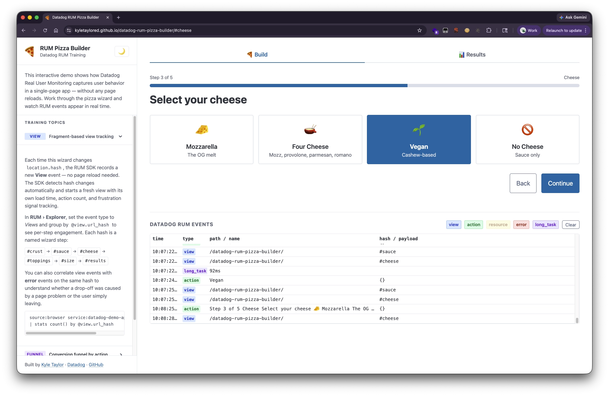
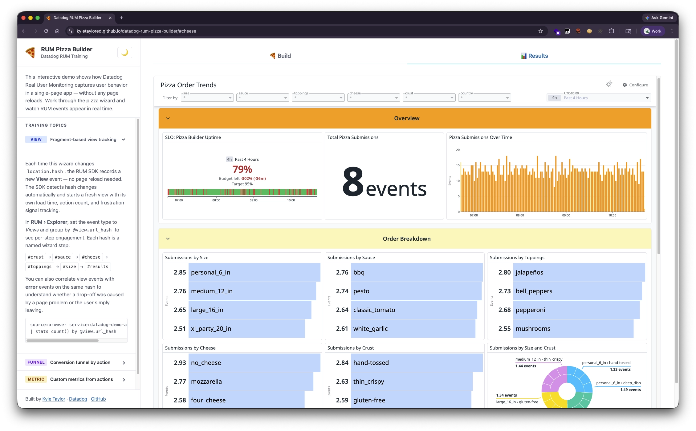

# 🍕 Datadog RUM Pizza Builder

A self-contained demo app for exploring [Datadog Real User Monitoring (RUM)](https://docs.datadoghq.com/real_user_monitoring/) — built as an interactive pizza order wizard.

**[Live Demo →](https://kyletaylored.github.io/datadog-rum-pizza-builder/)**



---

## Results dashboard

The Results tab embeds a live Datadog dashboard showing metric charts for pizza order submissions — broken down by crust, sauce, cheese, toppings, size, and geography.



---

## What this demonstrates

This app is designed as a hands-on training tool to show how Datadog RUM captures user behavior in a single-page app using URL fragment-based navigation.

### Views

Each wizard step updates the URL hash, triggering a new RUM view:

| Step     | Fragment    |
| -------- | ----------- |
| Crust    | `#crust`    |
| Sauce    | `#sauce`    |
| Cheese   | `#cheese`   |
| Toppings | `#toppings` |
| Size     | `#size`     |
| Results  | `#results`  |

In the RUM Explorer, these appear as distinct views with their own load times, action counts, and frustration signals — even though no page navigation occurred.

### Actions

RUM auto-captures clicks (e.g. "Continue", "Start Over") as `click` actions. The final step also fires a **custom action**:

```javascript
DD_RUM.addAction("pizza_order_submitted", {
  pizza_order: {
    crust: "Hand-Tossed",
    sauce: "BBQ",
    cheese: "Mozzarella",
    toppings: "Pepperoni",
    size: "Large (16 in)",
  },
});
```

In the RUM Explorer, filter by `@action.target.name:pizza_order_submitted` and use `@context.pizza_order.*` attributes as facets to see the full order payload.

### User tracking

When an order is submitted, the app calls `DD_RUM.setUser()` with a generated name, email, and a deterministic ID hashed from those values:

```javascript
DD_RUM.setUser({
  id: "3291847650",
  name: "Alex Smith",
  email: "alex.smith@example.com",
});
```

The ID is an idempotent djb2 hash of name + email — the same fictional person always gets the same ID, simulating a returning user across sessions. In the RUM Explorer, filter by `@usr.id`, `@usr.name`, or `@usr.email` to see all sessions for a given user.

### Error collection

The app collects errors in two ways:

- **Automatic** — `console.error()` calls are captured by the RUM SDK as error events with `source:console`. The synthetic error injection uses this path so no custom instrumentation is needed.
- **Automatic** — unhandled exceptions are captured as `source:source` errors.

In the RUM Explorer, filter by `@error.source:console` to see the synthetic injection errors.

### `beforeSend` callback

The RUM SDK is initialized with a `beforeSend` callback that intercepts every event before it's sent to Datadog. The demo uses this to power the live event log table at the bottom of the page — showing event type, view path, URL hash, action names, and context payloads in real time.

```javascript
beforeSend: (event) => {
  logRumEvent(event); // feeds the on-page event table
  return true; // always forward to Datadog
};
```

Returning `false` from `beforeSend` would discard the event. See the [Datadog docs](https://docs.datadoghq.com/real_user_monitoring/guide/enrich-and-control-rum-data/?tab=npm) for enrichment and filtering patterns.

### Session lifecycle

Clicking **Start Over** calls `DD_RUM.stopSession()`, ending the current RUM session. A new session begins on the next user interaction. This is useful for demonstrating session boundaries in training scenarios.

### Synthetic tests & SLO

A Datadog Browser Synthetic test runs against this app on a schedule, simulating the full wizard flow from start to finish. To generate varied data, the app detects the `DatadogSynthetics` user agent and randomizes the option order on each step — so the test always clicks the first card but gets a different pizza every run.

On ~20% of runs a simulated JS error is injected at a random step (2–5), blocking the test from completing. This intentionally produces a realistic mix of pass and fail results across the funnel. The session is tagged with `@context.synthetic.will_fail` and `@context.synthetic.intended_fail_step` via `setGlobalContext` so you can filter for intentional failures in the RUM Explorer.

An **SLO** is built on the synthetic monitor to track wizard completion rate over a rolling 7-day window. The Results dashboard includes an SLO widget showing current status and remaining error budget. A breach indicates something is broken beyond the expected noise level — correlate with the RUM funnel and session replays to investigate.

---

## Consent & Storage Lab

**[Try it →](https://kyletaylored.github.io/datadog-rum-pizza-builder/consent-lab/)**

A second, standalone demo at `/consent-lab/` for a real recurring sales-engineering question: an EU customer's legal team won't allow *any* cookie — including RUM's first-party session cookie — without prior consent, but they still want 100% error capture (replacing Sentry) and don't want session counts inflated by a multi-tab, refresh-heavy flow.

It demonstrates, live in the browser:

- **`sessionPersistence: 'cookie' | 'local-storage' | 'memory'`** — a live storage inspector shows exactly what RUM writes to `document.cookie` and `localStorage` under each mode.
- **`setTrackingConsent('pending' | 'granted' | 'not-granted')`** — a consent banner gates RUM end-to-end; nothing is written or sent until the user accepts.
- **Multi-tab / refresh session stability** — a `BroadcastChannel` compares the live RUM session ID across every open tab, showing why `memory` persistence risks inflating session counts for multi-tab flows (a new session per tab, and per refresh) while `local-storage` doesn't.
- **An always-on, cookie-free error pipe** — the Logs Browser SDK runs independently of the RUM consent gate with `sessionPersistence: 'local-storage'`, so 100% of errors are captured even before consent — the Sentry-equivalent backup plan.
- **An error-source coverage matrix** — the part of "Sentry parity" that's easy to get wrong. Datadog Error Tracking turns a log into an *issue* only when the log carries a stack trace (`error.stack`); a `status:error` log without one stays a log line forever. The matrix fires each error source in turn — uncaught exception, unhandled promise rejection, failed network request, `console.error`, `logger.error` — and reports what the SDK actually built for each, so the coverage claim is measured rather than assumed. Five of seven sources produce issues; the two that don't (`console.error("string")` and `logger.error("message")`, both missing an `Error` object) are exactly the shapes a codebase migrating off `Sentry.captureMessage()` is full of.
- **The recommended split for strict-consent deployments** — why you don't need `sessionPersistence: 'memory'` for all traffic: run the cookie-free Logs pipe always for error coverage, and consent-gated RUM on `cookie` for performance and accurate session counts. Errors never needed a stable session ID, so the always-on pipe can be stateless; RUM only exists post-consent, where a cookie is permitted.

The lab also calls out an important caveat: switching to `local-storage` removes an HTTP cookie, but the EU ePrivacy Directive's "storage on terminal equipment" language is read by some regulators as covering *any* client-side storage, not just cookies. It's framed in the UI as a mitigation to confirm with legal/DPO, not a guaranteed compliance fix.

---

## Running locally

Just open `index.html` in a browser — no build step, no server required. Everything is loaded from CDN.

```bash
open index.html
```

---

## Deployment

This repo is deployed via **GitHub Pages** from the `main` branch root. Any push to `main` updates the live demo automatically.

---

## Stack

- [Datadog RUM Browser SDK v6](https://docs.datadoghq.com/real_user_monitoring/browser/)
- [Web Awesome 3](https://webawesome.com/) — framework-agnostic web components, loaded from CDN
- A small design-token layer of our own (`tokens.css`) that every custom component reads from, so the framework underneath stays swappable
- Vanilla JS, no build tooling
